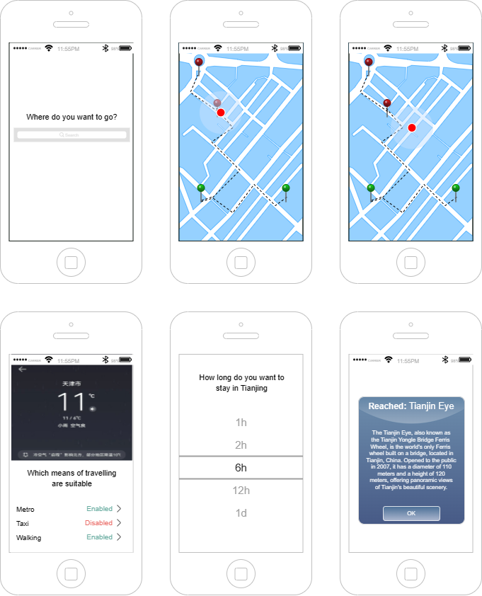

# THU Explorer
Travel planner app for 人机交互.\

## About the THU Explorer
The THU explorer is an andoid, ios, webapp that can be used to help students, teachers and visitors alike to view our campus and learn something about it.\
This is currently just a demo. It provides 3 buildings of the campus, which who's one is able to talk.\

## dev instructions
The app is built using ionic. So first follow the instructions on ionic which include:\
1. install node.js https://nodejs.org/en/download
2. make sure this and npm is install by checking the console with
    > node -v\
npm -v
3. install the ionic tooling by running
> npm install -g @ionic/cli native-run cordova-res
4. install chatGPT plugin by:
>npm install --save openai
5. set openApi key manually in our project
*Verification:* To verify the setup, reopen the command prompt and type the command below. It should display your API key: echo %OPENAI_API_KEY%

### running it on android
1. run \
>npx cap copy && npx cap sync
2. run \
>npx cap open android
more information can be found here https://ionicframework.com/docs/deployment/play-store

## Evaluation
We evaluated the efficiency of using our app by a user study. The results show an overall satisfaction with the gamified approach of learning something new about the campus.\
The Link to our questionaire is here: https://docs.google.com/forms/d/e/1FAIpQLSeoq0y1Ml81J3gZHEk9E7aBDIFcRCxoewFBuEOsgSindIUyUA/viewform?usp=sf_link

The mann whitney U test statistic is 29.5 and the p-value is 0.034. so the app is definitively preferred over the native version.

