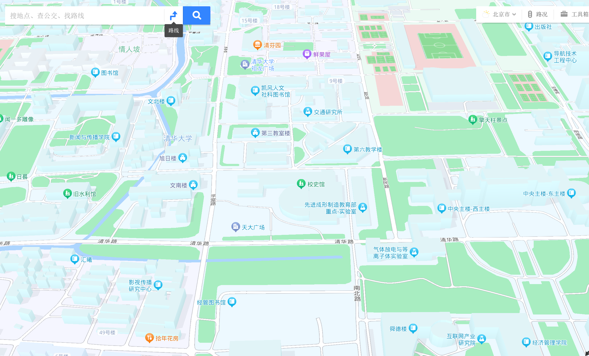
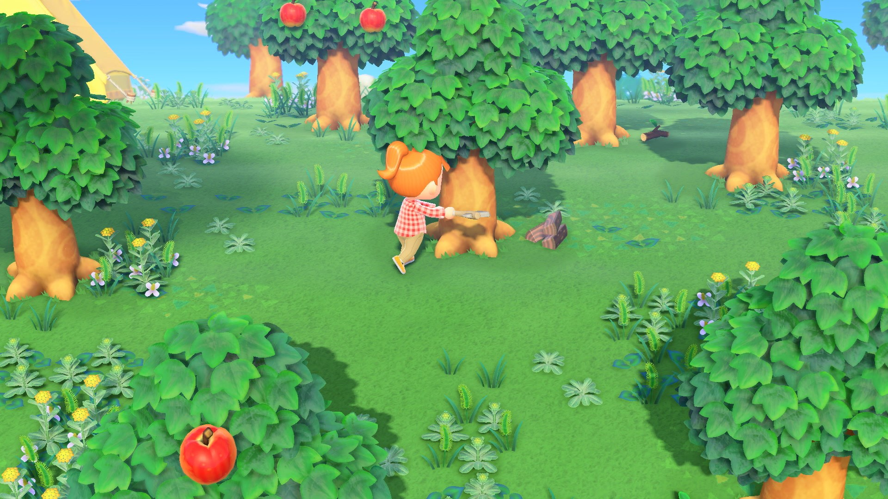
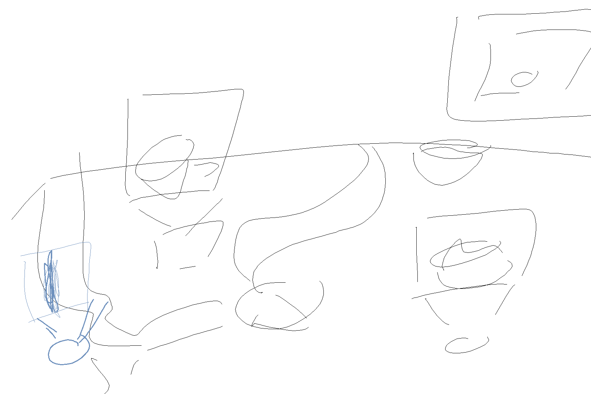

# THU Explorer
Travel planner app for 人机交互.\

## ideas
### Information requirements
- coffee
- gym
- beautiful scenery
- nice sitting places
- canteens
- building numbers
- users added content (with vote if good or bad)

! with pictures

### Artefacts
Using a baidu 3d map\

with a 1km radius for THU, which popps up like seen here\

with extra images taken by us as can be seen here in this illustration\
